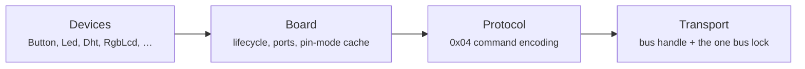

<div align="center">

# groveyard

**A modern, fully typed async Python library for GrovePi+ sensors and actuators on a Raspberry Pi.**

[](https://pypi.org/project/groveyard/)
[](https://pypi.org/project/groveyard/)
[](https://github.com/quantumwaffy/groveyard/actions/workflows/ci.yml)
[](https://quantumwaffy.github.io/groveyard/)
[](LICENSE)
[](https://quantumwaffy.github.io/groveyard/architecture/)

[**Documentation**](https://quantumwaffy.github.io/groveyard/) ·
[Quickstart](https://quantumwaffy.github.io/groveyard/getting-started/quickstart/) ·
[Architecture](https://quantumwaffy.github.io/groveyard/architecture/) ·
[API reference](https://quantumwaffy.github.io/groveyard/api/) ·
[Contributing](CONTRIBUTING.md)

</div>

---

> [!WARNING]
> **Not yet tested on real hardware.** Everything here is verified against the
> in-memory [`FakeTransport`](https://quantumwaffy.github.io/groveyard/guides/testing/),
> not a physical GrovePi+ board. If you can try it on real hardware, feedback
> and contributions are very welcome —
> [open an issue](https://github.com/quantumwaffy/groveyard/issues) or a PR.

Many concurrent tasks can share one I2C bus and one stateful device without
stepping on each other: the bus is serialised by a single lock, and each device
owns a second lock that makes a multi-step operation atomic. Nothing blocks the
event loop.

```python
import asyncio

from groveyard import AnalogPort, Board, DigitalPort, Led, LightSensor


async def main() -> None:
    async with Board.on_i2c() as board:
        sensor = LightSensor(board, AnalogPort.A0)
        led = Led(board, DigitalPort.D4)

        if await sensor.read_raw() < 300:
            await led.set_brightness(0.6)


asyncio.run(main())
```

## Install

```bash
pip install groveyard            # develop and test anywhere
pip install groveyard[hardware]  # on the Pi: adds smbus2
```

Python 3.12+. `smbus2` is the only runtime dependency, and only on the Pi — it
lives behind the transport abstraction, so nothing imports it off-device. See
[Installation](https://quantumwaffy.github.io/groveyard/getting-started/installation/)
for the full picture.

## Supported modules

| Class | Port | Highlights |
|---|---|---|
| `Button` | digital in | `is_pressed()` |
| `LightSensor` | analog in | raw counts, ratio, `read_resistance_kohm()` |
| `SoundSensor` | analog in | raw counts plus an averaging window |
| `Potentiometer` | analog in | ratio, `read_voltage()`, `read_degrees()` |
| `Led` | digital / PWM out | on/off plus `set_brightness(0.0..1.0)` |
| `Buzzer` | digital out | on/off plus cancellation-safe `beep(seconds)` |
| `Relay` | digital out | `close_circuit()` / `open_circuit()`, fail-safe |
| `Dht` | digital special | `DhtReading(temperature_celsius, humidity_percent)` |
| `Ultrasonic` | digital special | distance in cm, `None` when nothing is in range |
| `RgbLcd` | native I2C | 16×2 text plus RGB backlight |

Every analog driver keeps the raw `0..1023` reading reachable; unit conversions
are convenience on top, never a replacement. Full details:
[API reference](https://quantumwaffy.github.io/groveyard/api/).

## Concurrency, in one paragraph

Two hazards, two locks: a single bus lock serialises every I2C transaction
(bridged or native-I2C), and each device owns a second lock that makes a
multi-step operation on *that* device atomic. Two tasks on different devices
run concurrently; two tasks on the same device serialise automatically. Locks
are always taken **device → bus**, always with `async with`, and actuators
fail safe to *off* on close, disconnect, or a crash — even under cancellation.

```python
async with Board.on_i2c() as board:
    lcd = RgbLcd(board)
    ranger = Ultrasonic(board, DigitalPort.D5)
    async with asyncio.TaskGroup() as tasks:  # safe: different devices
        tasks.create_task(lcd.write_lines("scanning", "..."))
        tasks.create_task(ranger.read_distance_cm())
```

Full write-up, with sequence diagrams:
[Concurrency model](https://quantumwaffy.github.io/groveyard/architecture/concurrency/).

## Examples

[`examples/`](examples/README.md) has one small, runnable script per module — real
hardware, not the fake transport. If you have a GrovePi+ on hand, this is
also how you can help confirm the library actually works on real silicon;
see the warning at the top of this file.

## Testing without a Raspberry Pi

The library ships its own test doubles, so applications can be tested in CI:

```python
from groveyard import Board, DigitalPort, Button, FakeTransport
from groveyard.testing import FakeBridgeFirmware

firmware = FakeBridgeFirmware()
firmware.digital_inputs[DigitalPort.D3] = 1

async with Board(FakeTransport(responder=firmware)) as board:
    assert await Button(board, DigitalPort.D3).is_pressed()
```

The fake records every bus event with the id of the transaction it belongs to,
and records requested delays instead of sleeping — so timing and atomicity are
asserted, not waited for. See
[Testing without hardware](https://quantumwaffy.github.io/groveyard/guides/testing/).

## Errors

Everything derives from `GroveyardError`: `TransportError` (the bus failed),
`ProtocolError` (malformed reply), `DeviceNotReadyError` (the board answered
"not ready" on every attempt), `BoardError` (`NotConnectedError`,
`PortInUseError`) and `DeviceError` (`DeviceClosedError`). Out-of-range
arguments are caller bugs and raise plain `ValueError`. See
[Errors](https://quantumwaffy.github.io/groveyard/api/errors/).

## Architecture, in one picture



Each layer depends only on the one below it and on an abstraction, never a
concrete class — adding a driver means adding a class, never editing a core
layer. Full tour, with class diagrams and a traced example call:
[Layers overview](https://quantumwaffy.github.io/groveyard/architecture/).

## Contributing

Issues and PRs are welcome — see [CONTRIBUTING.md](CONTRIBUTING.md) for the
development setup, the four required gates, and a worked walkthrough of
adding a new driver. [CHANGELOG.md](CHANGELOG.md) tracks releases;
[SECURITY.md](SECURITY.md) covers vulnerability reporting.

## Licence

MIT — see [LICENSE](LICENSE).
