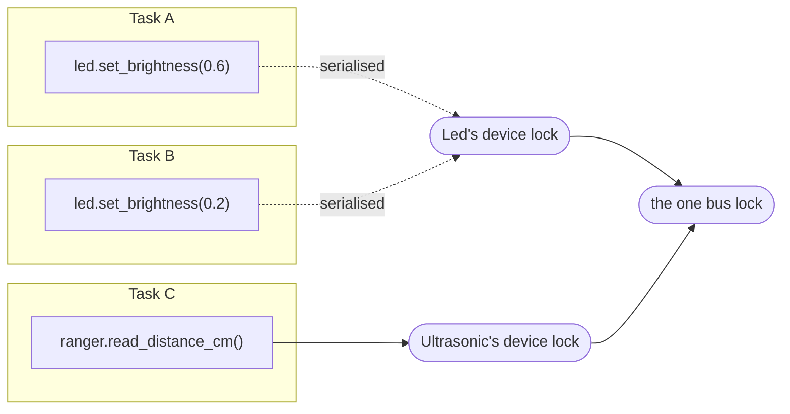

# Concurrency model

This is the part of the codebase worth understanding before you touch
anything else — every driver and every layer exists to uphold the guarantees
on this page.

## Two hazards, two locks

!!! abstract "The rule"
    **Device lock, then bus lock. Always in that order, never the reverse.**

- **The bus is shared.** A bridged operation is `write → sleep → read`
  (see [Wire protocol](../protocol.md#2-bridged-transaction-shape)). If two
  tasks interleave, one reads the other's reply. The
  [`Transport`][groveyard.Transport] wraps the *whole* transaction in one
  [`asyncio.Lock`][asyncio.Lock], so every exchange — bridged or native-I2C —
  is atomic with respect to every other.
- **Devices are stateful.** A single logical operation can span several bus
  transactions — configure-then-read, or a read-modify-write on the LCD or a
  dimmable LED. Each [`Device`][groveyard.Device] owns a second
  `asyncio.Lock` that makes that whole operation atomic, so two tasks driving
  the *same* device cannot tear its cached state. Two tasks driving
  *different* devices proceed concurrently, contending only briefly on the
  bus lock.



Task A and Task B fight over the *same* lock (they touch the same LED) and
run one after another. Task C touches a different device, so it runs
concurrently with both — it only waits its turn for the bus lock, and only
for the few milliseconds one transaction takes.

## Why this order, and not the other

If a task acquired the bus lock first and then tried to take a device lock —
or called back into another device while holding a bus session — a second
task already holding that device's lock and waiting for the bus would
deadlock against it. The library never does this: nothing inside a
[`Transport.session()`][groveyard.Transport.session] block calls a device
method, and no device method acquires the bus lock without first holding its
own.

The rule is enforced by convention and reviewed for, not encoded in the type
system — see [Contributing § Using Claude Code](../contributing.md#using-claude-code-in-this-repository-optional)
for the `async-reviewer` subagent that checks contributions against it.

## The `*_locked` convention

`asyncio.Lock` is **not reentrant**: acquiring a lock you already hold
deadlocks the task against itself. Every driver in the tree therefore follows
one shape:

```python
class DigitalOutputDevice(BridgedDevice[DigitalPort]):
    async def on(self) -> None:
        await self.set_state(state=True)  # public → public, fine

    async def set_state(self, *, state: bool) -> None:
        async with self._lock:  # take the lock exactly once
            await self._set_state_locked(state=state)

    async def toggle(self) -> bool:
        async with self._lock:
            await self._set_state_locked(state=not self._is_on)
            return self._is_on

    async def _set_state_locked(self, *, state: bool) -> None:
        # assumes the lock is already held — never takes it again
        await self._ensure_mode_locked(PinMode.OUTPUT)  # locked helper calling locked helper: fine
        await self._board.digital_write(self._port, ...)
        self._is_on = state
```

- Public methods acquire `self._lock` and immediately delegate.
- `*_locked` helpers assume the lock is held and never take it again, so they
  can call each other freely.
- [`toggle()`][groveyard.DigitalOutputDevice.toggle] reads the cached level
  and writes the new one *inside one critical section* — that is what stops
  two concurrent `toggle()` calls from both reading `False` and both ending
  up "on" instead of alternating.

## Cancellation safety

A task can be cancelled at any `await` point. Three patterns in the codebase
handle that without leaking a lock or stranding hardware in an unsafe state.

### `async with lock:` always releases

Every lock acquisition in the library goes through `async with`, so
cancellation mid-operation releases the lock automatically — the next
operation on that device is never blocked by a task that disappeared.

### A cancelled shutdown must not strand an energised actuator

[`Device.close()`][groveyard.Device.close] only marks the device closed
*after* `_shutdown_locked()` actually completes:

```python
async with self._lock:
    if self._closed:
        return
    try:
        await self._shutdown_locked()
    except asyncio.CancelledError:
        raise  # stays OPEN — caller can retry close()
    except GroveyardError:
        self._retire()
        raise  # unreachable hardware: nothing left to retry
    else:
        self._retire()
```

If cancellation landed here and `close()` had marked the device closed
anyway, every later `close()` — including the one
[`Board.disconnect()`][groveyard.Board.disconnect] runs during its own
shutdown sweep — would see `is_closed=True` and skip it, leaving (say) a
relay energised for good. Leaving the device open lets a retried `close()`
still reach the hardware.

### A cleanup sweep must finish even while it is being cancelled

[`Board.disconnect()`][groveyard.Board.disconnect] closes every attached
device and then the bus. That sweep runs under
[`asyncio.shield`][asyncio.shield]:

```python
async with self._lifecycle_lock:
    shutdown = asyncio.ensure_future(self._shut_everything_down())
    try:
        await asyncio.shield(shutdown)
    except asyncio.CancelledError:
        await shutdown  # let the sweep finish anyway
        raise  # then re-raise for the caller
```

Without the shield, a Ctrl-C or a collapsing
[`asyncio.TaskGroup`][asyncio.TaskGroup] could cancel `disconnect()` half-way
through the device list, leaving the rest of the actuators energised and the
bus descriptor open. With it, the sweep always finishes — every device is
closed, the bus is closed — and only *then* is the cancellation re-raised to
the caller, so structured concurrency still sees the cancellation happen.

[`Buzzer.beep()`][groveyard.Buzzer.beep] uses the same shield for the same
reason at device scale: the write that silences the buzzer runs shielded from
inside a `finally`, so a *second* cancellation (a repeated `Task.cancel()`, a
collapsing task group) cannot abort the silencing write itself and leave the
buzzer sounding with no task left to stop it. A transport failure during that
write is logged rather than allowed to replace the cancellation — swallowing
a `CancelledError` would break every enclosing task group's bookkeeping.

### Caches are written only after the traffic succeeds

`Led._brightness`, `Dht._last_reading`, `Ultrasonic._last_distance_cm`,
`RgbLcd._rows` / `_color` — every cached value in the driver layer is
assigned *after* the corresponding bus call returns successfully, never
before. A cancelled or failed operation therefore leaves the cache reporting
the last value that was actually true of the hardware, not a value the write
never reached.

## The lifecycle lock

[`Board.connect()`][groveyard.Board.connect] and
[`Board.disconnect()`][groveyard.Board.disconnect] are serialised by a third
lock, sitting *above* both device and bus locks:

```
lifecycle lock  →  device lock  →  bus lock
```

`disconnect()` calls into devices while holding it; no device ever calls back
into board lifecycle, so the order never inverts. This is what makes
`connect()` safe to call from several tasks at once (only one runs the
handshake) and stops a `close()` racing a `disconnect()` from opening or
closing the bus handle twice.

## Regression-testing a concurrency guarantee

The in-memory [`FakeTransport`][groveyard.FakeTransport] used throughout the
test suite deliberately **suspends** (`await asyncio.sleep(0)`) on every bus
operation, the same way a real transport suspends inside `asyncio.to_thread`.
Without that, a whole fake transaction would run to completion in one
scheduler step and `has_interleaved_sessions()` could never observe a real
interleaving — see [Testing without hardware](../guides/testing.md) for how
to use this when testing a new driver's concurrency contract.

## What is *not* protected: two transports on one physical bus

Every guarantee above is scoped to **one [`Transport`][groveyard.Transport]
instance** — the bus lock lives on `self`, not anywhere shared. Nothing stops
a caller from constructing two independent
[`SMBusTransport`][groveyard.SMBusTransport] objects with the same
`bus_number`: the OS happily opens `/dev/i2c-<n>` twice, and the two
instances then drive the same physical wires with two locks that know
nothing about each other. Every atomicity guarantee on this page silently
stops holding *between* them — a write queued through one can interleave with
a write queued through the other, with nothing to catch it.

[`SMBusTransport`][groveyard.SMBusTransport] guards against this *within a
process*: a class-level registry (`_open_bus_numbers`, protected by its own
lock, independent of any one instance's bus lock) rejects opening a
`bus_number` that another live `SMBusTransport` in the same process already
has open, with a [`TransportError`][groveyard.TransportError] naming the
conflict. It **cannot** guard against two separate *processes* opening the
same device node — that would need OS-level file locking (`flock` on
`/dev/i2c-<n>`, or a lock-file convention), which this library does not
attempt.

The practical rule: construct **one [`Board`][groveyard.Board] per physical
bus per process**, and share it between every driver that needs it. Don't
build a second one "just for this one sensor."
