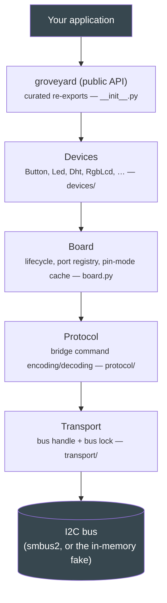
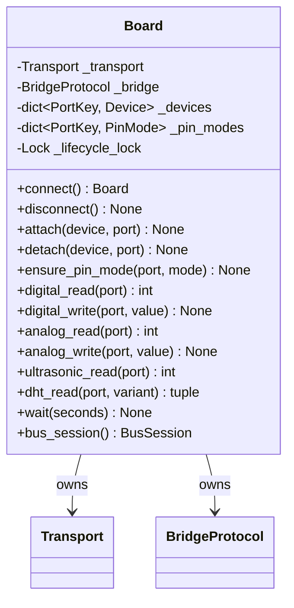
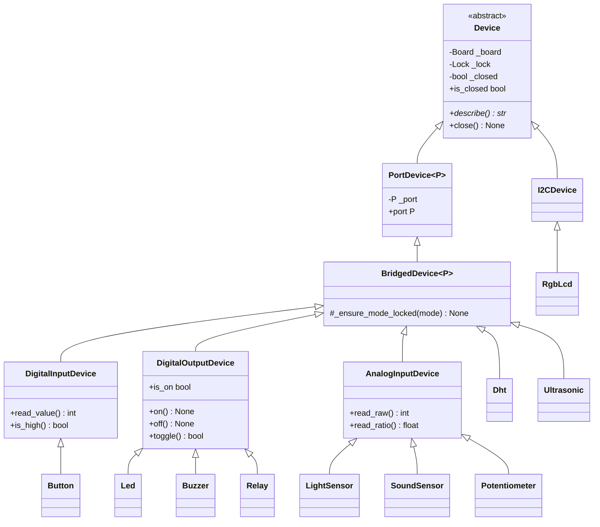
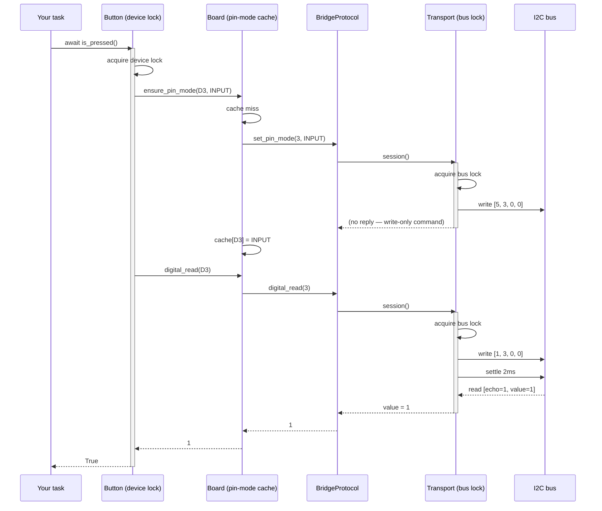

# Layers overview

groveyard is built as five layers, each depending only on the one below it.
This page explains what each layer owns, why the boundary is drawn where it
is, and how a call actually travels from your `await` down to the wire and
back.



Every arrow points one way. A change to `transport/` never has to touch
`devices/`; a new driver never has to touch `board.py`. That is Separation of
Concerns and the Dependency Inversion Principle applied literally: each layer
depends on the *abstraction* below it
([`Transport`][groveyard.Transport], [`Board`][groveyard.Board]), not on a
concrete implementation, and collaborators are always **injected through the
constructor** — `Board(transport)`, `Led(board, port)` — never built inside.

## The transport layer

**Owns:** the bus handle, and the single bus-wide lock.

```python title="src/groveyard/transport/base.py (shape, not full source)"
class Transport(ABC):
    def __init__(self) -> None:
        self._bus_lock = asyncio.Lock()

    @asynccontextmanager
    async def session(self) -> AsyncIterator[BusSession]:
        async with self._bus_lock:
            if not self.is_open:
                raise TransportError(...)
            yield self._create_session()
```

Every bridged operation on the wire is the same three-step transaction —
`write → sleep → read` — and it must not be interleaved with any other
traffic, bridged or not (see [Wire protocol](../protocol.md#2-bridged-transaction-shape)).
[`Transport.session()`][groveyard.Transport.session] is the *only* way to
touch the bus, and it only ever hands out a
[`BusSession`][groveyard.transport.base.BusSession] while holding `_bus_lock`. That single
fact is what makes the whole library race-free at the wire level — see
[Concurrency model](concurrency.md) for the full argument.

Two implementations satisfy the same interface (Liskov substitutability, and
the reason the whole library can be developed and tested without a Pi):

| Implementation | Used for | Notes |
|---|---|---|
| [`SMBusTransport`][groveyard.SMBusTransport] | real hardware | Wraps blocking `smbus2` calls in `asyncio.to_thread`; retries transient `OSError`. |
| [`FakeTransport`][groveyard.FakeTransport] | tests, development | Records every operation with the id of the transaction it belongs to; delays are recorded, not slept. |

`smbus2` is imported **lazily**, inside `SMBusTransport.open()`, for two
reasons: it is an optional install extra (`groveyard[hardware]`), and the test
suite must never import it even transitively. Everything above this layer
talks to the abstract `Transport`.

## The protocol layer

**Owns:** encoding requests and decoding replies for the `0x04` bridge
firmware command set — nothing else.

[`BridgeProtocol`][groveyard.protocol.bridge.BridgeProtocol] turns intent ("read pin 4") into
the exact four-byte frame the firmware expects, and turns a reply back into a
value. It:

- builds the fixed-width `[cmd, arg1, arg2, arg3]` frame;
- runs `write → settle → read` inside one [`Transport.session()`][groveyard.Transport.session],
  so the transaction is atomic;
- validates the echo byte and detects the `23` / `255` not-ready sentinels
  (see [Wire protocol §2](../protocol.md#2-bridged-transaction-shape));
- retries a **whole transaction** — not just the read — while the board
  reports "not ready", including through a per-command `validate` hook (used
  by the DHT driver to retry a `NaN` reading transparently, not surface it as
  an error);
- decodes multi-byte payloads: 16-bit ADC/distance words, and the two
  little-endian `float32` values a DHT reply carries.

This layer knows **nothing** about devices, ports, or per-device state — it
holds no lock of its own. Atomicity comes entirely from the transport's bus
lock, borrowed for the duration of `_exchange()`.

## The board layer

**Owns:** the connection's lifecycle, the port registry, and the pin-mode
cache. [`Board`][groveyard.Board] is the *single* collaborator a driver talks
to — a driver never reaches through the board into the protocol or transport,
which keeps the call graph flat and each layer's contract easy to verify in
isolation (Law of Demeter).



Four responsibilities, deliberately kept together because they share one
invariant — *a port belongs to exactly one device*:

1. **Lifecycle.** [`connect()`][groveyard.Board.connect] opens the transport
   and performs the firmware-version handshake;
   [`disconnect()`][groveyard.Board.disconnect] closes every attached device
   (driving actuators safely off) before closing the bus. Both are
   serialised by a lifecycle lock — see
   [Concurrency model](concurrency.md#the-lifecycle-lock).
2. **Port registry.** [`attach()`][groveyard.Board.attach] /
   [`detach()`][groveyard.Board.detach] are how a
   [`PortDevice`][groveyard.PortDevice] claims and releases its socket. A
   second driver on the same port raises
   [`PortInUseError`][groveyard.PortInUseError] immediately, rather than
   letting two drivers race over the same cached state.
3. **Pin-mode cache.** [`ensure_pin_mode()`][groveyard.Board.ensure_pin_mode]
   skips a redundant `pin_mode` command when the port is already configured
   the way a driver needs. The cache is **deliberately unlocked** — every
   entry is owned by exactly one device, and is only touched while that
   device holds its own lock, so there is no second writer to race with. See
   the warning on [`Board.set_pin_mode`][groveyard.Board.set_pin_mode] for the
   one way to break that invariant.
4. **Bridged operations & bus lending.** `digital_read`, `analog_write`, …
   forward to the protocol layer in terms of typed
   [`Port`][groveyard.Port] values. [`bus_session()`][groveyard.Board.bus_session]
   and [`wait()`][groveyard.Board.wait] lend the raw bus to native-I2C drivers
   (only [`RgbLcd`][groveyard.RgbLcd] today) that do not go through the
   bridge but still share the physical wires.

## The device layer

**Owns:** one class per physical module — intent, the small amount of state
that intent depends on, and the per-device lock that keeps that state
consistent. Byte encoding stays in `protocol/`; the bus handle stays in
`transport/`. A driver's job is narrow on purpose (Single Responsibility).



[`Device`][groveyard.Device] is the root: it owns the per-device
[`asyncio.Lock`][asyncio.Lock], the closed-state guard, and the
async-context-manager protocol (`async with led: ...` closes on exit,
including on error). Everything below it is Open/Closed in the literal
sense: adding a module means adding a subclass, never editing a base class.

- [`PortDevice[P]`][groveyard.PortDevice] — a device that occupies one Grove
  socket. Claims it in `__init__` via `board.attach(self, port)`, which is
  what turns "two drivers on one port" into an immediate constructor error.
- [`BridgedDevice[P]`][groveyard.BridgedDevice] — adds
  `_ensure_mode_locked()`, the one piece of setup every bridged module needs
  (configure the pin direction once, cache it).
- [`I2CDevice`][groveyard.I2CDevice] — the equivalent base for a device with
  its own controller on the bus instead of a Grove socket; today only
  [`RgbLcd`][groveyard.RgbLcd] uses it, claiming the board's single shared
  I2C port.
- Four second-level bases capture the shape most starter-kit modules share —
  digital in, digital out, analog in — so a concrete driver like
  [`Button`][groveyard.Button] or [`LightSensor`][groveyard.LightSensor] is
  often only a docstring and one or two convenience methods on top (Don't
  Repeat Yourself). [`Dht`][groveyard.Dht] and
  [`Ultrasonic`][groveyard.Ultrasonic] extend `BridgedDevice` directly — they
  are "special" bridged commands the firmware configures internally, so
  neither calls `_ensure_mode_locked()` (documented on each class).

**Locking discipline**, followed by every driver in the tree: a public method
acquires `self._lock` and immediately delegates to a private `*_locked`
helper; `*_locked` helpers never take the lock again and are free to call
each other. `asyncio.Lock` is **not reentrant** — this is the rule that keeps
every driver in the codebase deadlock-free, and it is enforced in review
(there is no way to express it in the type system). See
[Concurrency model](concurrency.md) for why the lock is always taken
*before* any bus traffic.

## The public API layer

**Owns:** the curated surface in `groveyard/__init__.py`. This
is the only module an application should import from. It re-exports the
board, ports, errors, every driver, both transports, and the protocol-level
`FirmwareVersion` / `DhtVariant` — everything an application needs without
reaching into `groveyard.devices.base` or `groveyard.protocol` directly.

`groveyard.testing` is exported separately: it ships *with* the library
(applications need it to test themselves) but is not part of the everyday
surface, so it stays out of the top-level namespace. See
[Testing without hardware](../guides/testing.md).

## Following one call through every layer

`await button.is_pressed()` on a fresh [`Button`][groveyard.Button] — pin
mode not yet configured — touches every layer in order:



Two transactions, two independent bus-lock acquisitions, one device-lock
critical section spanning both — which is exactly what makes "configure the
pin, then read it" one atomic logical operation from the caller's point of
view, even though it is two atomic bus transactions underneath.

## SOLID, concretely

The design principles in `CLAUDE.md` are not aspirational — here is where
each one is load-bearing in this codebase:

| Principle | Where |
|---|---|
| **S**ingle responsibility | `transport/` moves bytes; `protocol/` encodes commands; `board.py` manages lifecycle and ports; each driver models one device. |
| **O**pen/closed | New module → new [`Device`][groveyard.Device] subclass. New backend → new [`Transport`][groveyard.Transport] subclass. Neither touches an existing class. |
| **L**iskov substitution | [`FakeTransport`][groveyard.FakeTransport] is a drop-in [`Transport`][groveyard.Transport] — same guarantees, same exceptions, checked by the fact that every test in the suite runs against it. |
| **I**nterface segregation | [`Transport`][groveyard.Transport], [`BusSession`][groveyard.transport.base.BusSession] and [`Device`][groveyard.Device] are small and focused; nothing depends on a method it does not use. |
| **D**ependency inversion | Every layer receives its collaborator through `__init__` — `Board(transport)`, `Led(board, port)` — and depends on the abstraction, never a concrete class. |

## Extension points

- **A new sensor or actuator module:** subclass the closest fit in
  `groveyard.devices.base` — see
  [Writing a new driver](../guides/new-driver.md) for a full walkthrough.
- **A new transport backend** (a different bus multiplexer, a mock over the
  network, …): subclass [`Transport`][groveyard.Transport] and implement
  `_open`, `_close`, `is_open` and `_create_session`; everything above the
  transport layer keeps working unchanged.
- **A different retry policy:** [`RetryPolicy`][groveyard.RetryPolicy] is
  injected into both [`Transport`][groveyard.Transport] subclasses and
  [`BridgeProtocol`][groveyard.protocol.bridge.BridgeProtocol] — construct one and pass it in
  rather than editing the defaults.
